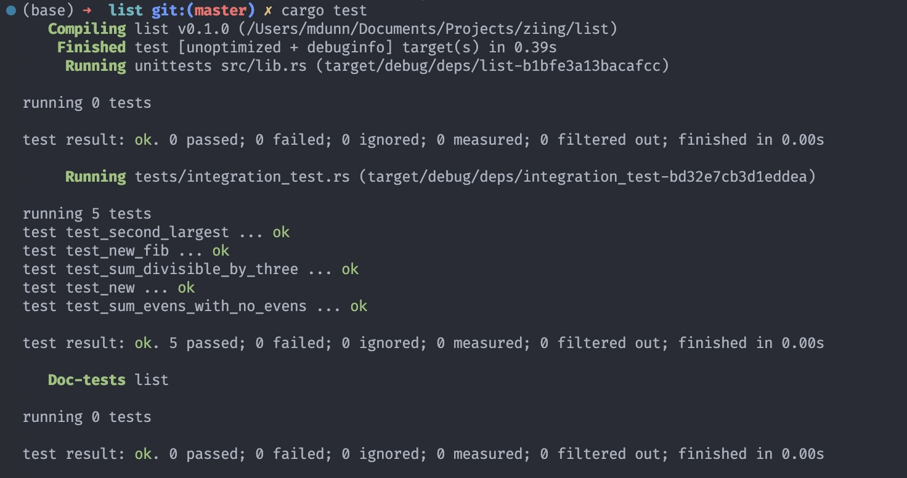

# Ziing Option 1

In the language of your choice, create an Integer list class. The class should Include methods that perform the following:

- Sums all even integers.
- Sums all integers divisible by 3.
- Returns the second largest integer in the list.
- Returns an n length integer list initialized to the Fibonacci sequence.

The purpose is to implement the methods described above. There is no need to ensure you have a fully functional list class; You only need to go as far as being able to initialize the object using an array, i.e., `arr = IntList([33,7,2,9,10,1]);`

## Solution

I ended up choosing to code my solution in `Rust` cause its cool. I have been trying to learn it for the past couple of months making this a good way of practicing.

The **IntList* class is in the `lib.rs` file in the src directory. The unit tests are in the `integration_test.rs` file in the test directory.

As tradition with most of my classes in uni, I have added a screenshot to this file showing the unit tests passing.

